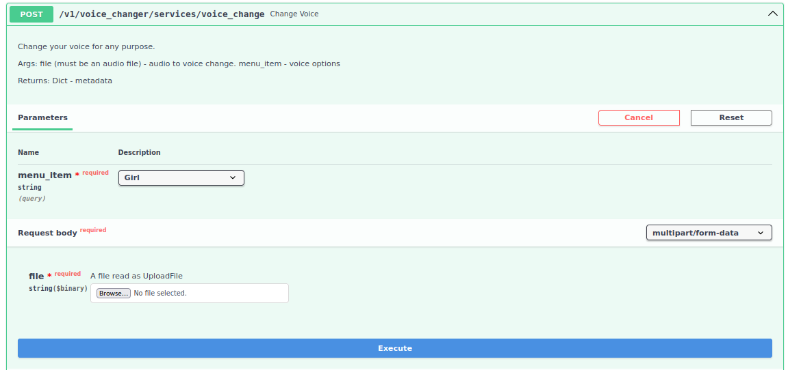

# Voice Changer Service

<div align="center">
  <p>
    </a>
  </p>
</div>

Change your voice for any purpose.

---

## Quick setup:

```sh
conda create -n voice python==3.12
cd voice-changer
pip install -r requirements.txt
fastapi dev src/app/main.py
```
